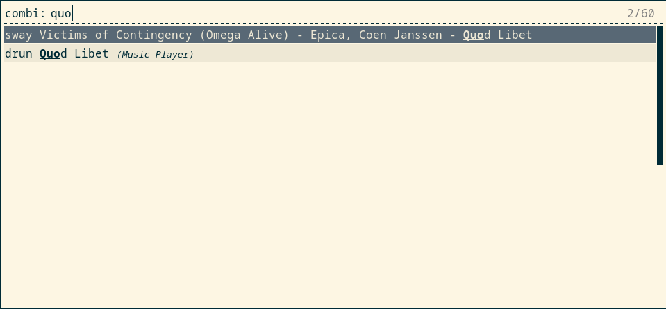

# yaws

Yet Another Window Switcher for Rofi+Sway.

A Rofi mode for switching windows under Sway that can be used in combination with other Rofi modes.




## Installation

The script depends on the following binaries:

- bash
- swaymsg
- jq
- xargs
- rofi (not a real dependency, but the script is useless without)

### Fedora

For Fedora there is a COPR you can use:

```
e# dnf copr enable ludwigd/sway-supplemental
# dnf install yaws
```

### Other

Copy `yaws` to a location in your `$PATH`, e.g., `~/bin`, and make it executable with `chmod +x yaws`.

## Usage

The intended way to use this script is in combination with other Rofi modes. To combine it with `drun` mode, launch Rofi like this:

```
rofi -modes combi -combi-modes sway:yaws,drun -show combi
```